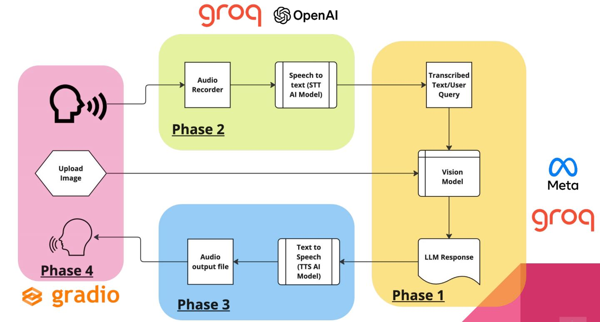

# AI Agent powered Medical Assistant

## Table of Contents

1.  **Introduction**
2.  **System Architecture**
3.  **Video Demonstration**
4.  **Components**
5.  **What I Learnt**
6.  **Technologies**
7.  **Getting Started**
8.  **Use Cases**
9.  **Special Mention**
10.  **Prerequisites**
    * Installing FFmpeg and PortAudio
        * macOS
        * Linux
        * Windows
    * Setting Up a Python Virtual Environment
        * Using Pipenv
        * Using `venv` and `pip`
        * Using Conda

## 1. Introduction

* Multi-modal AI system integrating audio, text, and image processing.
* Combines speech-to-text (STT), vision models, large language models (LLMs), and text-to-speech (TTS).
* Built using Groq, OpenAI, Meta, and Gradio technologies.

## 2. System Architecture




## 3. Video Demonstration

[](MEDI BOT - Made with Clipchamp.mp4)

* **Phase 1 (Yellow):** Text/query processing via vision models and LLMs.
* **Phase 2 (Green):** Audio capture and STT conversion (OpenAI).
* **Phase 3 (Blue):** LLM response converted to audio via TTS.
* **Phase 4 (Pink):** Gradio UI for image uploads and interaction.

## 4. Components

* **Audio Recorder:** Captures user audio.
* **STT (OpenAI):** Audio to text conversion.
* **Vision Model (Meta):** Image processing.
* **LLM:** Response generation.
* **TTS:** Text to audio conversion.
* **Gradio UI:** User interface.

## 5. What I Learnt

* Integration of different AI models.
* Multi-modal application development.
* Gradio UI prototyping.
* Cloud AI (OpenAI) and local processing.
* Data flow management in AI systems.

## 6. Technologies

* **Groq:** (Hardware/deployment)
* **OpenAI:** (STT)
* **Meta:** (Vision)
* **Gradio:** (UI)
* **Python:** (Core language)
* **FFmpeg/PortAudio:** (Likely audio processing)

## 7. Getting Started

* Input audio via the recorder (Phase 2).
* Upload images via Gradio (Phase 4).
* System processes and responds with audio.

## 8. Use Cases

* Multi-modal AI assistants.
* Accessibility tools.
* Educational applications.
* Creative content generation.
* Customer service bots with visual context.

## 9. Special Mention

* A special thank you to [AIwithhassan/ai-doctor-2.0-voice-and-vision](https://github.com/AIwithhassan/ai-doctor-2.0-voice-and-vision) for their inspiring work.

## 10. Prerequisites

### Installing FFmpeg and PortAudio

These libraries are crucial for audio processing.

#### macOS

1.  **Install Homebrew (if not already installed):**

    ```bash
    /bin/bash -c "$(curl -fsSL [https://raw.githubusercontent.com/Homebrew/install/HEAD/install.sh](https://raw.githubusercontent.com/Homebrew/install/HEAD/install.sh))"
    ```

2.  **Install FFmpeg and PortAudio:**

    ```bash
    brew install ffmpeg portaudio
    ```

#### Linux (Debian-based, e.g., Ubuntu)

1.  **Update the package list:**

    ```bash
    sudo apt update
    ```

2.  **Install FFmpeg and PortAudio:**

    ```bash
    sudo apt install ffmpeg portaudio19-dev
    ```

#### Windows

1.  **Download FFmpeg:**
    * Visit the official FFmpeg download page: [FFmpeg Downloads](https://ffmpeg.org/download.html)
    * Navigate to the Windows builds section and download the latest static build.
2.  **Extract and Set Up FFmpeg:**
    * Extract the downloaded ZIP file to a folder (e.g., `C:\ffmpeg`).
    * Add the `bin` directory to your system's PATH:
        * Search for "Environment Variables" in the Start menu.
        * Click on "Edit the system environment variables."
        * In the System Properties window, click on "Environment Variables."
        * Under "System variables," select the "Path" variable and click "Edit."
        * Click "New" and add the path to the `bin` directory (e.g., `C:\ffmpeg\bin`).
        * Click "OK" to apply the changes.
3.  **Install PortAudio:**
    * Download the PortAudio binaries from the official website: [PortAudio Downloads](http://www.portaudio.com/download.html).
    * Follow the installation instructions provided on the website.

### Setting Up a Python Virtual Environment

It's recommended to use a virtual environment to isolate project dependencies.

#### Using Pipenv

1.  **Install Pipenv (if not already installed):**

    ```bash
    pip install pipenv
    ```

2.  **Install Dependencies with Pipenv (from the `Pipfile`):**

    ```bash
    pipenv install
    ```

3.  **Activate the Virtual Environment:**

    ```bash
    pipenv shell
    ```

#### Using `venv` and `pip`

1.  **Create a Virtual Environment:**

    ```bash
    python -m venv venv
    ```

2.  **Activate the Virtual Environment:**

    * **macOS/Linux:**

        ```bash
        source venv/bin/activate
        ```

    * **Windows:**

        ```bash
        venv\Scripts\activate
        ```

3.  **Install Dependencies (from `requirements.txt`):**

    ```bash
    pip install -r requirements.txt
    ```

#### Using Conda

1.  **Create a Conda Environment:**

    ```bash
    conda create --name myenv python=3.11
    ```

    (Adjust `python=3.11` to your desired Python version.)

2.  **Activate the Conda Environment:**

    ```bash
    conda activate myenv
    ```

3.  **Install Dependencies (from `requirements.txt`):**

    ```bash
    pip install -r requirements.txt